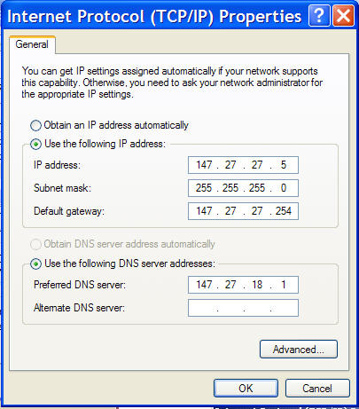



# Building a 60m LAN Between Two Blocks (2002)

In 2002, when I was 14, computer clubs were booming.  
Most of my free time after school and on weekends was spent there playing local multiplayer games like:

- Half-Life
- Counter-Strike
- Red Alert
- Warcraft

Playing **PvP over LAN** was far more exciting than playing alone.

Eventually, a friend who lived in the next apartment block and I decided to build our **own local network** so we could play from home.

---

## The Setup

The distance between our apartments was roughly **60 meters**.

To make it work we bought:

- **60 meters of Ethernet cable**
- **2 network cards**

We also asked several neighbors if we could temporarily use their **balconies to route the cable between buildings**.

Surprisingly, they agreed.

---

## Network Configuration

Once the cable was installed we configured the network manually.
IP: 192.168.1.*
Subnet mask: 255.255.255.0
Default getaway 192.168.1.1

After installing the drivers and configuring the addresses, the connection worked.

The moment we saw the computers communicating over the network felt like magic.

---

## What the LAN Enabled

This simple connection changed everything.

Instead of physically visiting each other with CDs and DVDs, we could:

- play **PvP games** from our own rooms
- share **movies, music, and files**
- occasionally share **internet access**

We spent countless hours playing:

- FIFA
- racing games
- Counter-Strike

---

## The Messaging Problem

One unexpected challenge was **communication**.

We didn’t have a messaging application.

So we improvised.

Our workaround:

1. Write a message in a **.txt or .doc file** on the desktop.
2. Copy it to the other computer over the network.

But how did we know when a new message arrived?

We invented a notification system.

To signal a new message, we would try to access the **A:\ floppy disk drive** remotely.  
The drive made a distinctive mechanical noise.

When the other person heard the sound, they knew:

> “A message has arrived.”

Then they would open the shared desktop file, read the message, and respond.

Primitive, but it worked.

---

## One Year Later

About a year later we discovered a real **LAN chat application**, which made the whole system much easier.

But building that first network taught me something important:

> Understanding technology often starts with curiosity, experimentation, and improvisation.

That small DIY LAN was my first real experience with **computer networking**.

Looking back, it was the beginning of my interest in **systems, networks, and security**.

---

You can explore my work in more detail under [Projects](/projects), [Research](/research), and [Notes](/notes). 